# Kompaniya qo'llanmasi

Ushbu bo'limda kompaniyani ro'yxatdan o'tkazish, balansni to'ldirish, xodimlar qo'shish va ularning xarajatlarini boshqarish tushuntiriladi.

## Ro'yxatdan o'tish

!!! note "Oldindan tayyorlang"
    Ro'yxatdan o'tish uchun [inbiz.uz](https://inbiz.uz/uz/) platformasida tasdiqlangan yuridik shaxs (kompaniya) hisobingiz va uning **e-imzo** sertifikati bo'lishi kerak.

1. [https://qr.ol.uz/uz/register](https://qr.ol.uz/uz/register) sahifasiga kiring.
2. «qr.ol.uz'dan qanday foydalanasiz?» degan savolga **Kompaniya** variantini tanlang.
3. **Kompaniya sifatida davom etish** tugmasini bosing — sizni inbiz platformasiga yo'naltiradi.

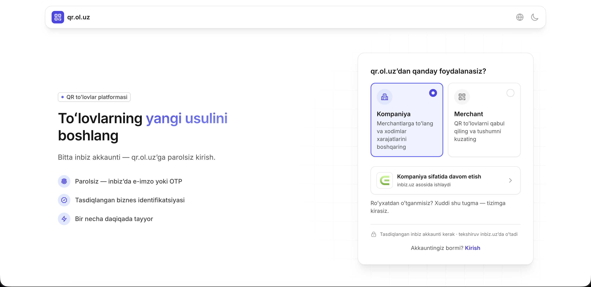

!!! tip "Avval ro'yxatdan o'tganmisiz?"
    Xuddi shu tugma orqali tizimga qayta kirasiz — alohida «kirish» jarayoni shart emas.

### inbiz orqali kirish

inbiz sahifasida kompaniyangizning **e-imzo** sertifikatini tanlab, **Shu sertifikat bilan kirish** tugmasini bosing. Agar inbiz'ga oldinroq kirgan bo'lsangiz, bu qadam avtomatik o'tib ketiladi.

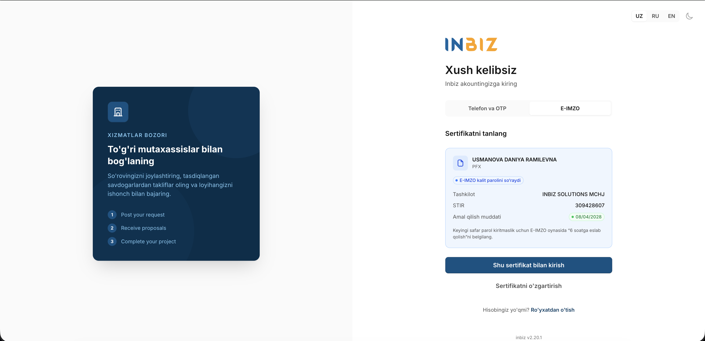

Keyin inbiz sizdan qr.ol.uz bilan ma'lumot ulashishni tasdiqlashni so'raydi. **To'g'ri kompaniya tanlanganiga ishonch hosil qiling** va davom etish tugmasini bosing.

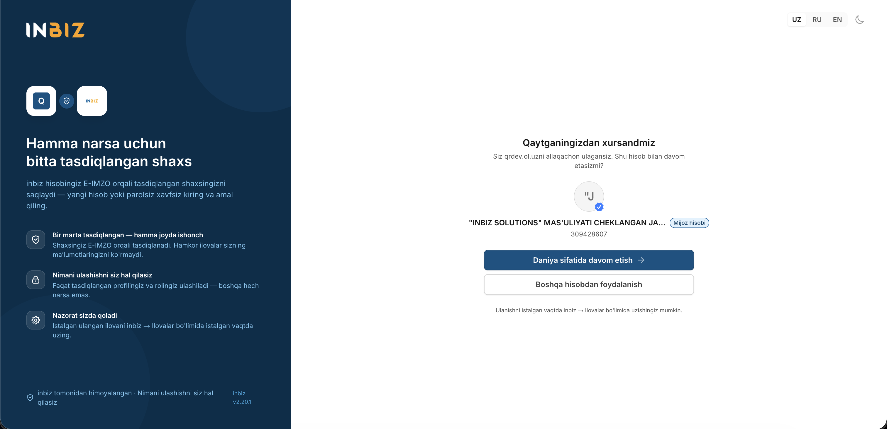

### Telefon raqamini tasdiqlash

inbiz'dan qaytganingizdan so'ng qr.ol.uz telefon raqamingizni so'raydi. Bu — oxirgi qadam: raqamingizni tasdiqlasangiz, keyingi safar e-imzosiz, faqat telefon raqami va SMS kod bilan kira olasiz.

!!! warning "Bu qadamni o'tkazib yubormang"
    Telefon raqamini tasdiqlamasangiz, har safar e-imzo bilan kirishga to'g'ri keladi.

1. Telefon raqamingizni kiriting va **Kod yuborish** tugmasini bosing.

    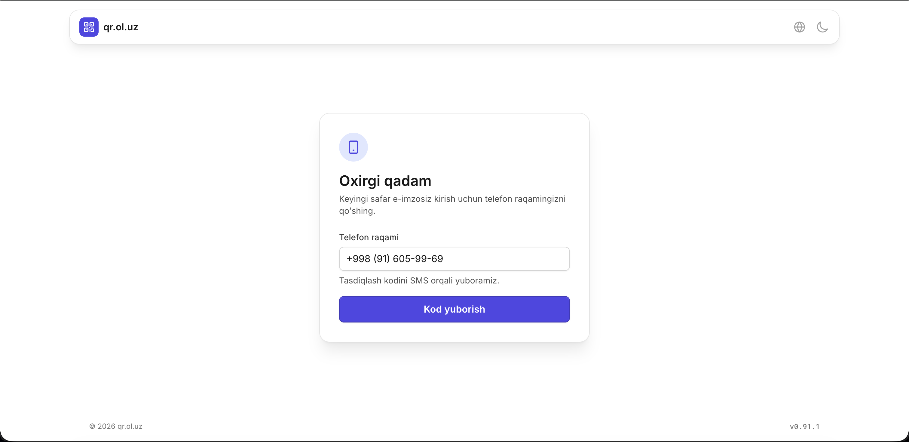

2. SMS orqali kelgan 6 xonali kodni kiriting va **Tasdiqlash** tugmasini bosing.

    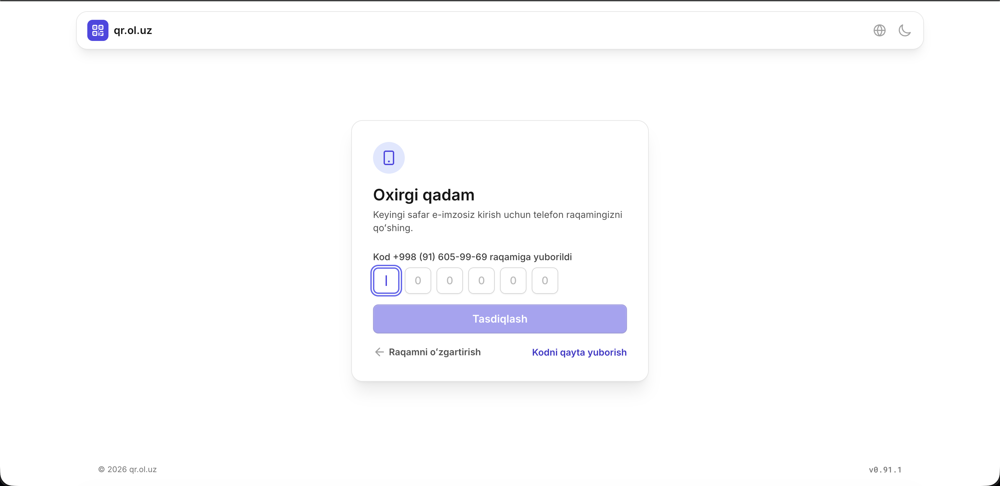

Shu bilan ro'yxatdan o'tish yakunlanadi va siz kompaniya ish maydoniga o'tasiz.

## PIN kod o'rnatish

Birinchi qiladigan ishingiz — **PIN kod** o'rnatish. Bu 5 xonali raqamli kod bo'lib, platformadagi muhim amallarni (masalan, to'lovlarni) tasdiqlash uchun ishlatiladi.

1. Chap menyudan **Sozlamalar** sahifasiga o'ting ([qr.ol.uz/uz/settings](https://qr.ol.uz/uz/settings)).
2. **To'lov PIN kodi** bo'limida o'rnatish tugmasini bosing va 5 xonali kodingizni kiriting.

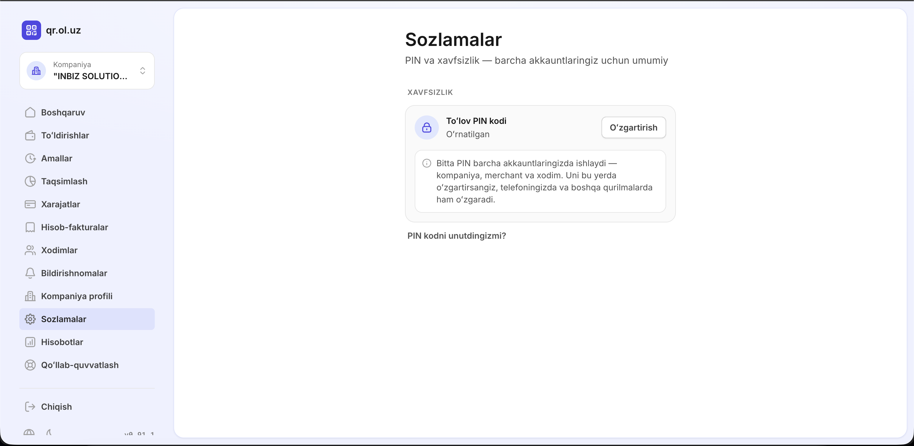

!!! info "Bitta PIN — barcha akkauntlar uchun"
    PIN kod akkauntga emas, shaxsingizga bog'lanadi: kompaniya, merchant va xodim akkauntlaringizning barchasida bitta PIN ishlaydi. Uni bir joyda o'zgartirsangiz, hamma qurilma va akkauntlarda o'zgaradi.

## Boshqaruv paneli

**Boshqaruv** (bosh sahifa) — kompaniya moliyasining umumiy ko'rinishi:

- **Umumiy balans** — kompaniya hamyonidagi jami mablag' va hamyon raqami;
- **Xodimlarga taqsimlangan** — xodimlarga ajratib berilgan mablag'lar yig'indisi;
- **Taqsimlash uchun mavjud** — hali taqsimlanmagan, bo'sh mablag';
- **Eng katta taqsimotlar** — eng ko'p mablag' ajratilgan xodimlar ro'yxati.

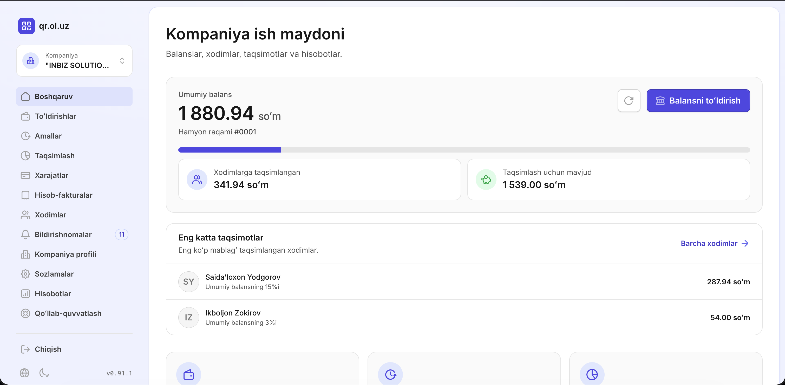

## Balansni to'ldirish

Kompaniya balansi bank o'tkazmasi orqali to'ldiriladi:

1. Boshqaruv panelidagi **Balansni to'ldirish** tugmasini bosing — to'ldirish bo'yicha ko'rsatma ochiladi.
2. Ko'rsatmada qr.ol.uz platformasining bank rekvizitlari (hisob raqami, MFO, STIR) ko'rsatilgan. Kompaniyangiz bank hisobidan aynan shu hisobga o'tkazma qiling.
3. **To'lov izohida hamyoningiz ID raqamini (masalan, `#0006`) albatta ko'rsating** — usiz to'lovingiz qaysi kompaniyaga tegishli ekanini aniqlab bo'lmasligi mumkin.

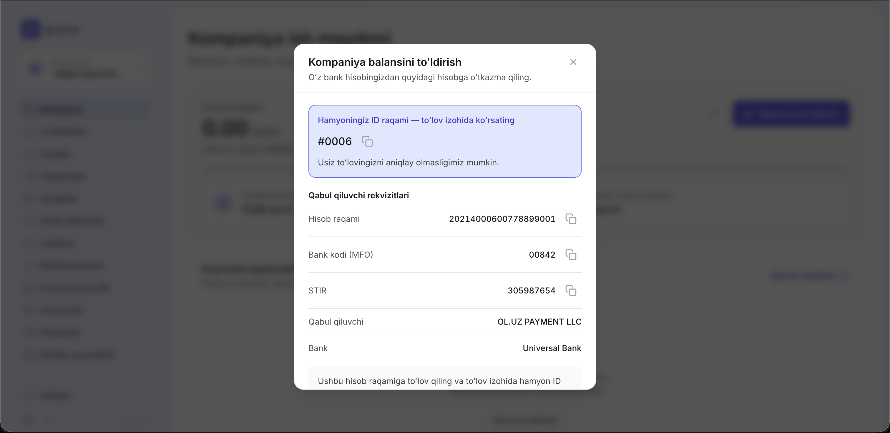

O'tkazma bankdan o'tgach, mablag' kompaniya balansingizga avtomatik qo'shiladi.

## Xodimlarni boshqarish

### Xodim qo'shish

Chap menyudan **Xodimlar** sahifasiga o'ting. Bu yerda kompaniyangizga qo'shilgan barcha xodimlar ro'yxati ko'rinadi.

Yangi xodim qo'shish uchun **Xodim qo'shish** tugmasini bosing va quyidagi ma'lumotlarni kiriting:

| Maydon | Izoh |
| --- | --- |
| Familiya, Ism | Majburiy |
| Otasining ismi | Ixtiyoriy |
| JSHSHIR (PINFL) | 14 xonali shaxsiy identifikatsiya raqami |
| Telefon raqami | Xodim shu raqam orqali SMS kod bilan tizimga kiradi |
| Lavozim | Ixtiyoriy |

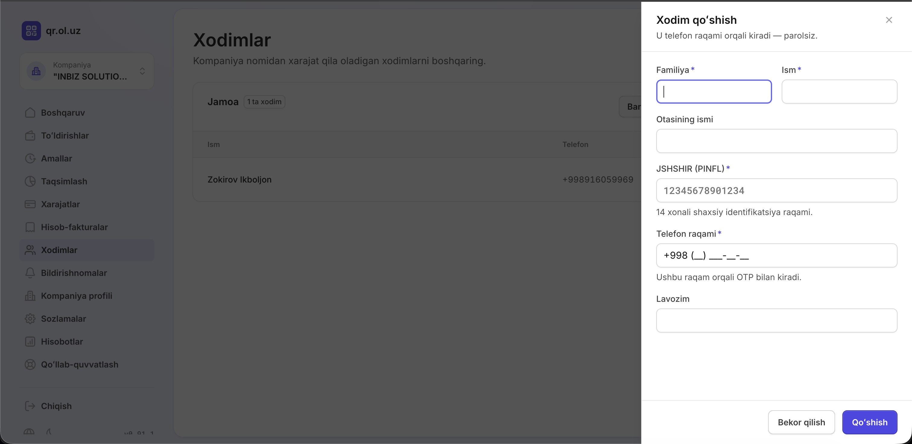

!!! info "Xodimga parol kerak emas"
    Xodim siz kiritgan telefon raqami orqali [qr.ol.uz](https://qr.ol.uz) saytiga kiradi — SMS kod bilan, parolsiz.

### Xarajat ruxsatlarini sozlash

Xodim qatoriga bossangiz, o'ng tomonda **Xodim xarajatlari** oynasi ochiladi. Bu yerda:

- **Ajratilgan balans** — xodimga ajratilgan mablag' miqdori;
- **Kompaniya balansiga ruxsat** — yoqilsa, xodim o'zining ajratilgan mablag'i bo'lmaganda umumiy kompaniya balansidan to'lov qila oladi;
- **Xarajat toifalari** — xodim qaysi turdagi do'konlarda to'lov qila olishini belgilaydi (masalan, Avtoservis, Ovqatlanish, Yoqilg'i). Kerakli toifalarni alohida yoqing yoki **Barcha toifalarga ruxsat** tugmasi bilan hammasini birdan yoqing.

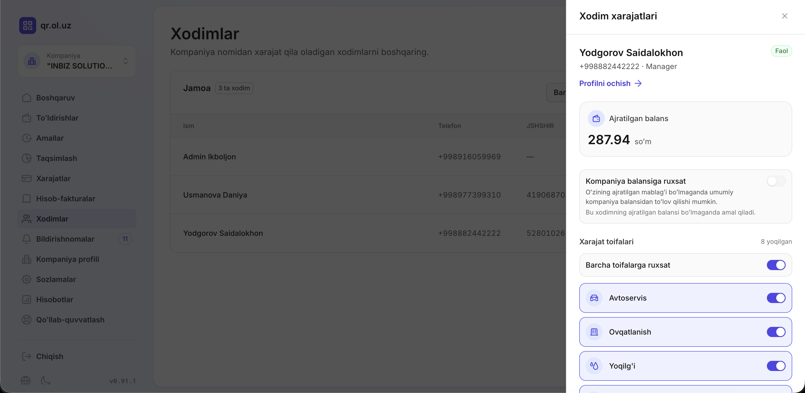

!!! warning "Toifa yoqilmagan bo'lsa, to'lov o'tmaydi"
    Xodim faqat unga yoqilgan toifalarga tegishli do'konlarda to'lov qila oladi. Hech bir toifa yoqilmagan xodim to'lov qila olmaydi.

## Akkauntlar o'rtasida almashish

Agar sizning shaxsingizga bir nechta akkaunt (masalan, kompaniya rahbari va ayni paytda xodim) biriktirilgan bo'lsa, ular o'rtasida chiqib-kirmasdan almashishingiz mumkin:

1. Chap yuqoridagi akkaunt kartasini bosing.
2. Ochilgan **Akkauntni almashtirish** oynasida barcha akkauntlaringiz ro'yxati ko'rinadi — keraklisini tanlang.

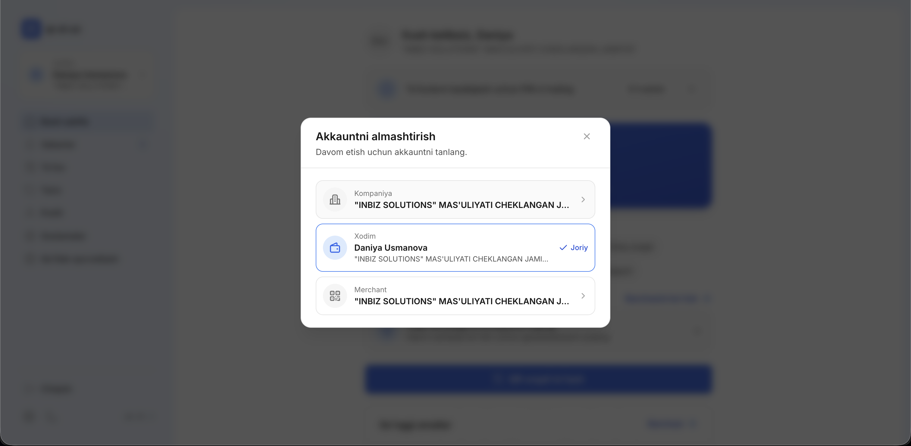
