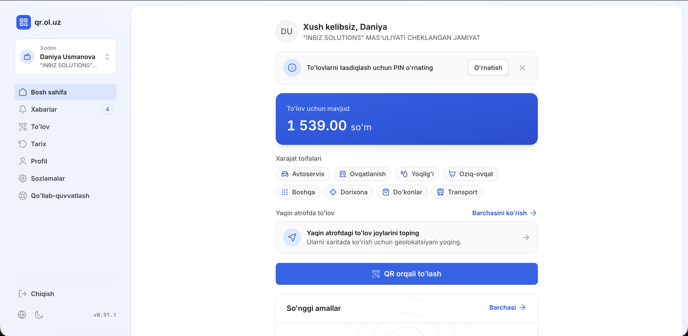

# Xodim qo'llanmasi

Ushbu bo'lim kompaniya tomonidan qo'shilgan xodimlar uchun: tizimga kirish, balansni ko'rish va do'konlarda QR kod orqali to'lov qilish.

## Tizimga kirish

Kompaniyangiz sizni xodim sifatida qo'shganidan so'ng, [qr.ol.uz](https://qr.ol.uz) saytiga kompaniyaga bergan telefon raqamingiz orqali kirasiz:

1. **Kirish** sahifasida telefon raqamingizni kiriting.
2. SMS orqali kelgan tasdiqlash kodini kiriting — parol kerak emas.

## PIN kod o'rnatish

Birinchi kirishdan so'ng bosh sahifada **«To'lovlarni tasdiqlash uchun PIN o'rnating»** degan eslatma chiqadi. **O'rnatish** tugmasini bosib, 5 xonali PIN kodingizni yarating — usiz to'lov qila olmaysiz.

!!! info "Bitta PIN — barcha akkauntlar uchun"
    PIN kod shaxsingizga bog'lanadi: agar sizda bir nechta akkaunt bo'lsa (masalan, xodim va kompaniya), hammasida bitta PIN ishlaydi.

## Ish maydoni

Bosh sahifada quyidagilarni ko'rasiz:

- **To'lov uchun mavjud** — sizga ajratilgan va hozir ishlatishingiz mumkin bo'lgan mablag';
- **Xarajat toifalari** — kompaniyangiz sizga ruxsat bergan toifalar (masalan, Avtoservis, Ovqatlanish, Yoqilg'i, Oziq-ovqat). Siz faqat shu toifalarga tegishli do'konlarda to'lov qila olasiz;
- **Yaqin atrofda to'lov** — geolokatsiyani yoqsangiz, yaqin-atrofdagi to'lov qabul qiladigan do'konlarni xaritada ko'rasiz;
- **So'nggi amallar** — oxirgi to'lovlaringiz ro'yxati.

## QR kod orqali to'lov qilish

1. Bosh sahifadagi **QR orqali to'lash** tugmasini bosing — kamera ochiladi.
2. Do'kon kassasidagi QR kodni skaner qiling.
3. Ochilgan to'lov sahifasida summani kiriting yoki tekshiring.
4. To'lovni 5 xonali **PIN kodingiz** bilan tasdiqlang.

To'lov shu zahoti amalga oshadi va tarixingizda ko'rinadi.

!!! tip "Kamera ishlamasa — kodni qo'lda kiriting"
    Har bir kassaning QR kodi ostida `XXXX-XXXX` ko'rinishidagi 8 belgili kod ham yoziladi. QR skaner ishlamay qolsa, shu kodni qo'lda kiritib to'lov qilishingiz mumkin.

!!! warning "To'lov o'tmayaptimi?"
    Quyidagilarni tekshiring:

    - do'kon toifasi sizga ruxsat etilgan **xarajat toifalari** ichida bo'lishi kerak;
    - **balansingiz** to'lov summasiga yetarli bo'lishi kerak (yoki kompaniyangiz sizga umumiy balansdan foydalanishga ruxsat bergan bo'lishi kerak);
    - PIN kod to'g'ri kiritilganiga ishonch hosil qiling.

    Muammo davom etsa, kompaniyangiz mas'ul xodimiga murojaat qiling.

## To'lovlar tarixi

Chap menyudagi **Tarix** sahifasida barcha to'lovlaringiz, sanasi, do'kon nomi va summasi bilan ko'rinadi.

## Bildirishnomalar

**Xabarlar** bo'limida to'lovlaringiz, balansingizga qilingan taqsimotlar va akkauntingizga oid o'zgarishlar haqidagi bildirishnomalarni ko'rasiz.
